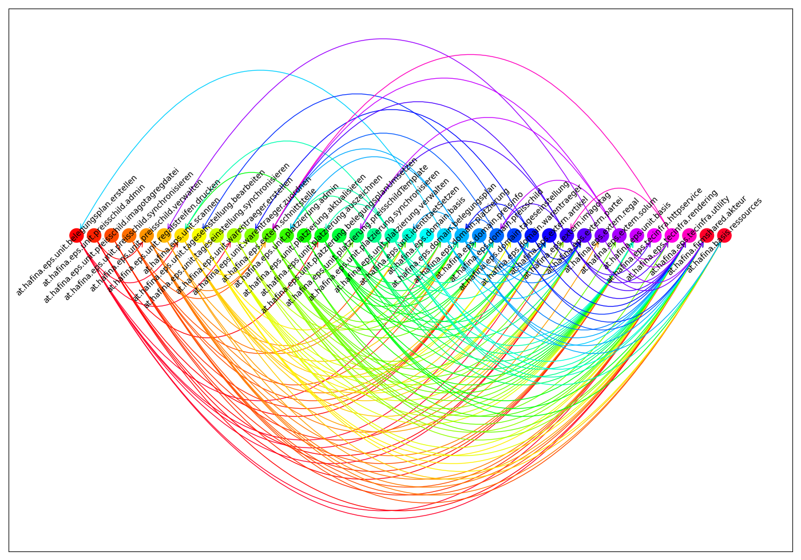

# mpsModelDeps
* Visualisiert Model-Dependencies in JetbrainsMPS-Projekten als Arc-Diagramm
* Nicht sonderlich ausgefeilt und noch work in progress

### Beispiel



## Verwendung
* Sortierung wird ueber `--sortby` beeinflusst - je hoeher das Gewicht desto weiter rechts wird sortiert
* mit `--ignore` werden Package-Namen, die den Substring enthalten, ignoriert

### Beispielaufruf
```sh
python3 modelDeps.py \
 --path ~/projects/ePS/solutions/at.hafina.eps/models/ \
 --ignore "at.hafina.eps.app" \ 
 --sortby "eps.unit.basis"=460 "platzierung"=110 "identitaet"=130 schnittstelle=105
```

### Allgemeine Verwendung
```
usage: modelDeps [-h] --path PATH [--ignore [IGNORE ...]] [--sortby [KEY=VALUE ...]]
                 [--clearsort]

optional arguments:
  -h, --help            show this help message and exit
  --path PATH           path to MPS-models
  --ignore [IGNORE ...]
                        list of (sub)strings to ignore (models or deps)
  --sortby [KEY=VALUE ...]
                        list of (substrings) and weigths to sort by. e.g. "inout=10"
  --clearsort           Clear current sortweights

        current sortweights:
        	".unit." = 10
	".domain." = 20
	".extern." = 30
	".tecinfra." = 40
	DEFAULT = 50
        current ignorelist:
            ['test', 'org.modellwerkstatt']
```
